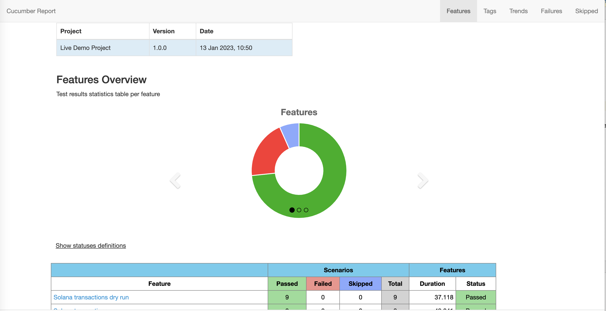
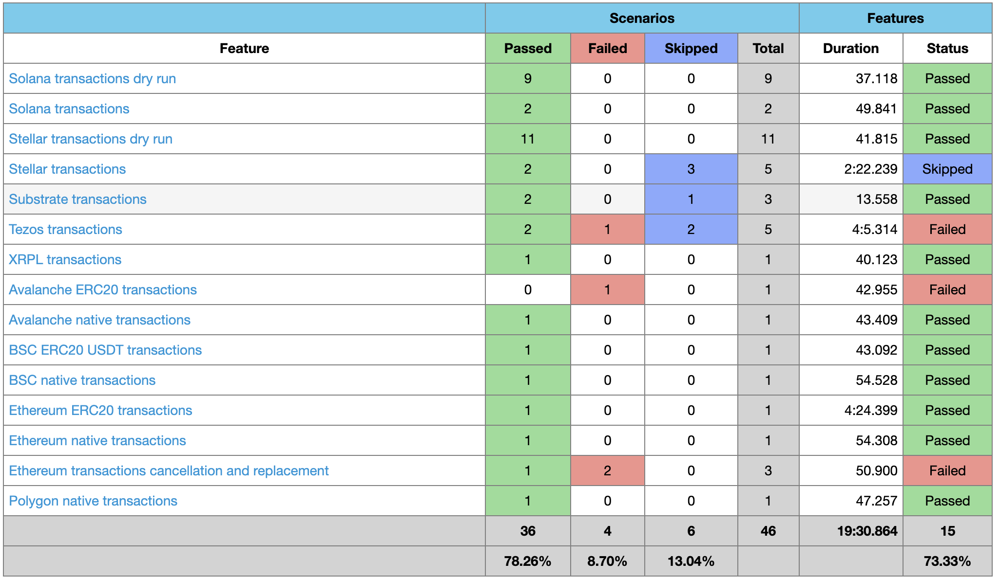
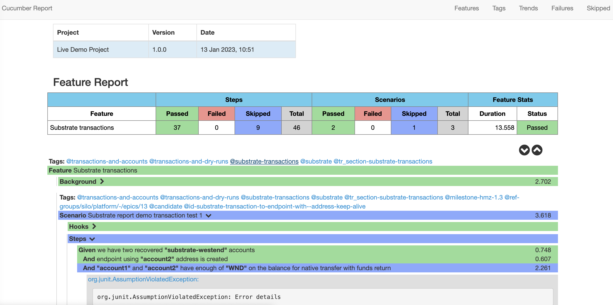
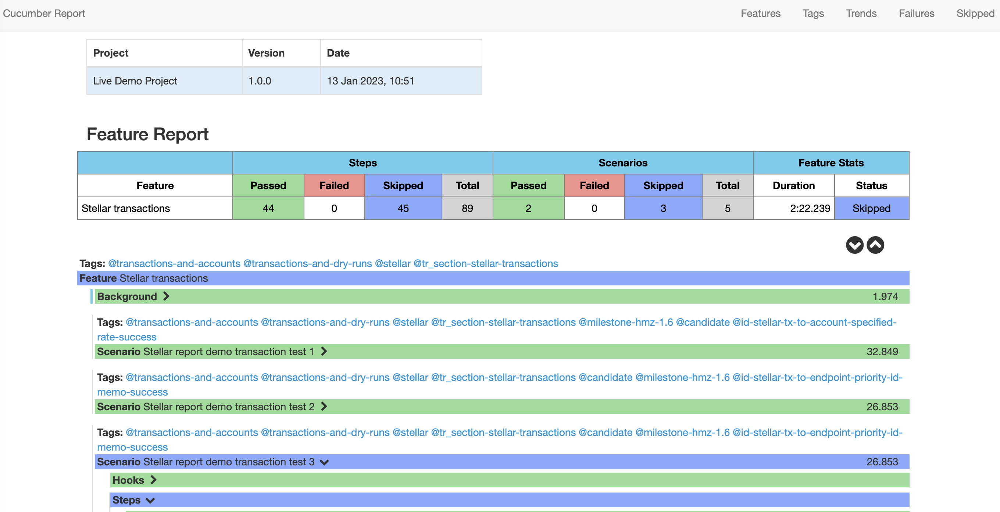
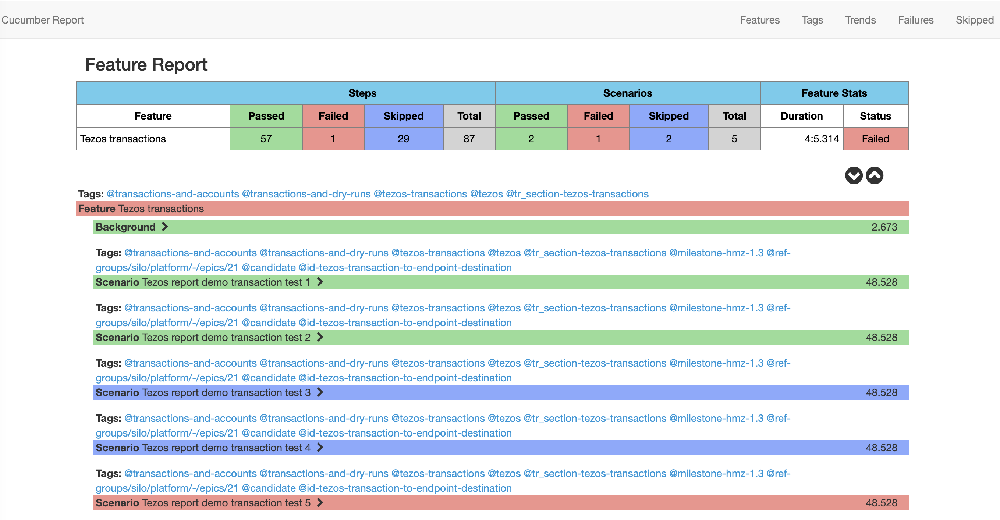
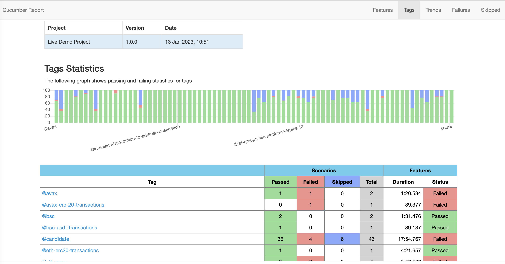
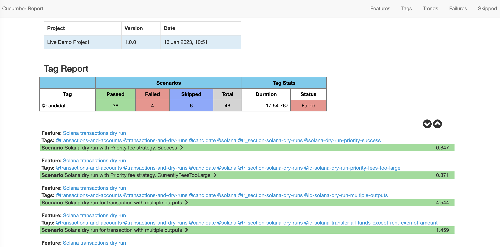
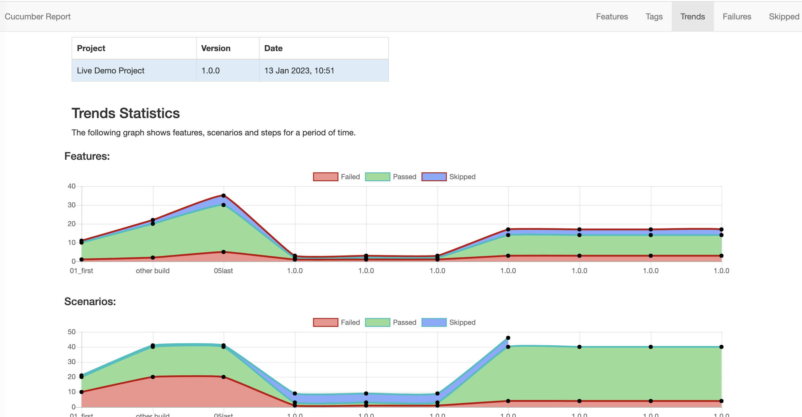

# Project

This project is an adaptation of [cucumber-reporting](https://github.com/damianszczepanik/cucumber-reporting) library.

Main changes:

1) interpretation of the test results in the report for the projects which heavily use junit assumptions to determine if the test can be continued in the current conditions.
   Thus skipped is not interpreted as a failure for Feature
    - Skipped Step: not executed due to failed assumption
    - Skipped Scenario: not executed as pre-conditions were not met to start or continue the test due to failed assumption which is not a defect
    - Skipped Feature: has more skipped scenarios then passed scenarios and does not have failed scenarios
2) Added Skipped Page report
3) Removed Steps from Features Overview for easier reading
4) No feature to set non-failing statuses as the feature is not failing when having skipped scenarios. It is dynamically decided if the feature is Skipped or Passed based on the ratio of skipped/failed scenarios

# Publish pretty [cucumber](https://cucumber.io/) reports

This is a Java report publisher primarily created to publish cucumber reports on the Jenkins build server.
It publishes pretty html reports with charts showing the results of cucumber runs. It has been split out into a standalone package so it can be used for Jenkins and maven command line as well as any other packaging that might be useful. Generated report has no dependency so can be viewed offline.

## Background

Cucumber is a test automation tool following the principles of Behavioural Driven Design and living documentation. Specifications are written in a concise human readable form and executed in continuous integration.

This project allows you to publish the results of a cucumber run as pretty html reports. In order for this to work you must generate a cucumber json report. The project converts the json report into an overview html linking to separate feature files with stats and results.

## Install

Add a maven dependency to your pom

```xml
<dependency>
   <groupId>tech.paranoidandroid</groupId>
   <artifactId>cucumber-html-reporting</artifactId>
   <version>1.0.0</version>
   <scope>test</scope>
</dependency>
```

## Usage

In RunCucumberTest class

cucumber-html-reporting needs cucumber results json file produced by cucumber [built-in plugin](https://cucumber.io/docs/cucumber/reporting/?lang=java)

```
@RunWith(Cucumber.class)
@CucumberOptions(
        features = "src/test/resources",

        plugin = {
                "json:target/cucumber/cucumber.json"
        }
)

```

```
import io.cucumber.junit.CucumberOptions;
import org.junit.AfterClass;
import org.junit.runner.RunWith;

import java.io.File;

import tech.paranoidandroid.cucumber.Configuration;
import tech.paranoidandroid.cucumber.ReportBuilder;
import tech.paranoidandroid.cucumber.presentation.PresentationMode;
import tech.paranoidandroid.cucumber.sorting.SortingMethod;


@RunWith(Cucumber.class)
@CucumberOptions(
        features = "src/test/resources",

        plugin = {
                "json:target/cucumber/cucumber.json"
        }
)

public class RunCucumberTest {
  
   public static void generateCustomReport(){
        File reportOutputDirectory = new File("target/cucumber/cucumber-html-report");
        List<String> jsonFiles = new ArrayList<>();
        jsonFiles.add("target/cucumber/cucumber.json");

        String projectName = "project_name";
        // If the project contains CI yaml file with version to be deployed, it can be useful to pass it here
        String buildNumber = "tested_version";

        Configuration configuration = new Configuration(reportOutputDirectory, projectName);
        configuration.setBuildNumber(buildNumber);

        configuration.setSortingMethod(SortingMethod.NATURAL);
        configuration.addPresentationModes(PresentationMode.EXPAND_ALL_STEPS);

        ReportBuilder reportBuilder = new ReportBuilder(jsonFiles, configuration);
        reportBuilder.generateReports();
    }
    
    @AfterClass
    public static void stopExecution() {
        generateCustomReport();
    }
}
```

There is a feature overview page:




In the report table the new logic is demonstrated:

Features are not failed, if they don't have failed scenarios. Features are skipped only if they contain more skipped scenarios, then passed scenarios, and don't have failed scenarios.
At least one failed step makes scenario Failed, at least one failed scenario makes feature Failed.



Results pages per feature:







Tags overview page shows how many scenarios and features are covered by tag and the results.



And you can drill down into tag specific reports:




